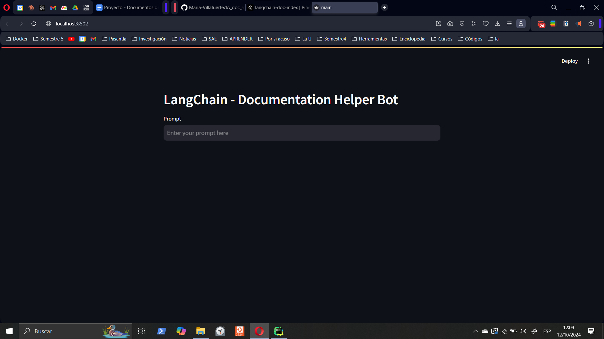
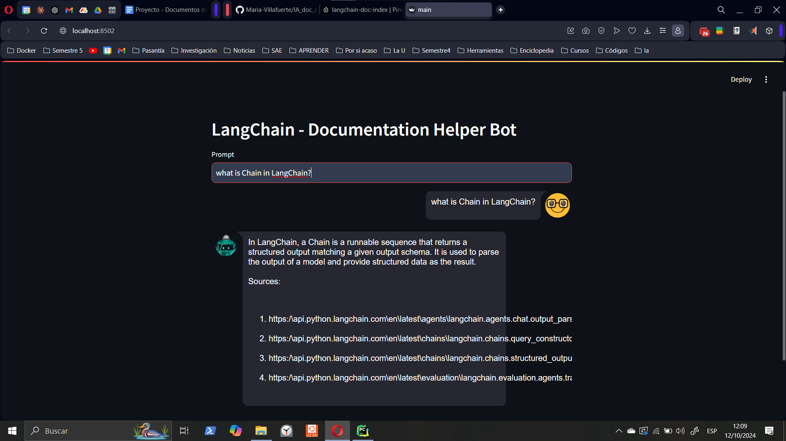

# LangChain Documentation Helper Bot

This project implements a documentation helper bot using LangChain, OpenAI, Pinecone, and Streamlit. The bot can answer questions about LangChain documentation, providing relevant information and sources.

## Features

- Interactive chat interface using Streamlit
- LangChain integration for advanced language processing
- OpenAI's GPT model for generating responses
- Pinecone vector database for efficient document retrieval
- Source citations for answers

## Prerequisites

- Python 3.7+
- OpenAI API key
- Pinecone API key and index name

## Installation

1. Clone the repository:
   ```
   git clone https://github.com/yourusername/IA_doc_assistant.git
   cd IA_doc_assistant
   ```

2. Install the required packages:
   ```
   pip install -r requirements.txt
   ```

3. Set up your environment variables:
   Create a `.env` file in the root directory and add the following:
   ```
   OPENAI_API_KEY=your_openai_api_key
   PINECONE_API_KEY=your_pinecone_api_key
   INDEX_NAME=your_pinecone_index_name
   ```

## Usage

Run the Streamlit app:
```
streamlit run main.py
```

Navigate to the provided URL in your web browser to interact with the chat interface.

## Project Structure

- `main.py`: Streamlit frontend for the chat interface
- `core.py`: Backend logic for running the LLM and handling document retrieval
- `requirements.txt`: List of Python dependencies
- `.env`: Environment variables (not included in the repository)

## How it Works

1. The user enters a query in the Streamlit interface.
2. The query is processed by the LangChain pipeline, which includes:
   - Rephrasing the query based on chat history
   - Retrieving relevant documents from Pinecone
   - Generating a response using OpenAI's language model
3. The response, along with source citations, is displayed in the chat interface.

## Images code running 

